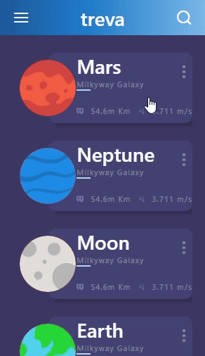

# Planets App In React native.

This app is inspired by [Vijay Verma's UI design](https://www.uplabs.com/posts/space-travel-ui) and the flutter tutorial of same ui published on [sergiandreplace](https://sergiandreplace.com/planets-flutter-from-design-to-app/)

I wanted to create it in React Native. Finally did it.

# Working Expo Snack:

[Expo Snack](https://snack.expo.io/@xeteke8423/planetsappreactnative)

# Screenshot:

